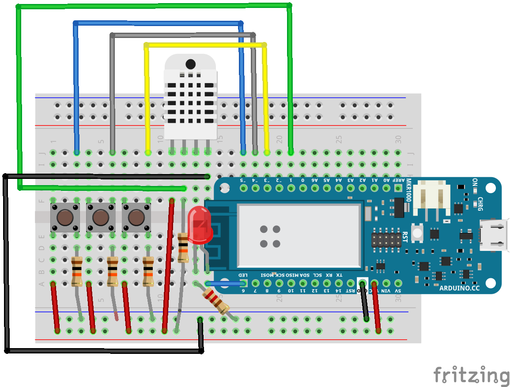

# Lab 1: Arduino and Buttons

We need to wire the hardware. We are going to wire a temperature and humidity sensor, an LED and three buttons. If you're unfamiliar with buttons the [Arduino button tutorial](https://www.arduino.cc/en/Tutorial/Button) may be helpful. 

The idea is to create a sentiment capturing device similar to the ones you see at airports, hotels, restaurants etc. Button one is for satisfied, button 2 neutral and button three is for unsatisfied.

>Note: This labs was created by [Don Coleman](https://github.com/don/phillycodecamp/blob/master/exercises/exercise7.md)

## Suggested wiring instructions:

1. Move the LED from E1 and E2 to C13 and C14. Ensure the longer leg is in C14.
   * Move the resistor from C1 so that it goes between A13 to the negative rail
   * Move the blue wire attached to pin 6 to A14 so it connects to the positive leg of the LED
2. Add 3 buttons at E1, E4, and E7
   * The buttons should straddle the center line on the board
   * Add a 10,000 &#937; pulldown resistors to the right leg of each button
     * 10,000 &#937; resistor from A3 to the negative rail
     * 10,000 &#937; resistor from A6 to the negative rail
     * 10,000 &#937; resistor from A9 to the negative rail
   * Add red (or orange) wire from the positive rail to the left leg of each button
     * A1 to the positive rail
     * A4 to the positive rail
     * A7 to the positive rail
   * Wire the right leg on the top half of the button to pins 3, 4, and 5
     * Blue wire from J3 to J17 (pin 5)
     * Purple wire from J6 to J18 (pin 4) 
     * Yello wire from J9 to J19 (pin 3)

## Test

1. Open [/arduino/ButtonTest/ButtonTest.ino](/arduino/ButtonTest/ButtonTest.ino) in the Arduino IDE
1. Upload the code to the board _Tools -> Upload_
1. Open the serial monitor _Tools -> Serial Monitor_
1. Verify you see a message in the serial monitor when a button is pressed
1. Verify the LED lights when a button is pressed